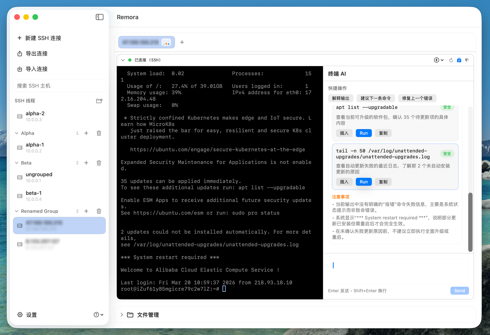
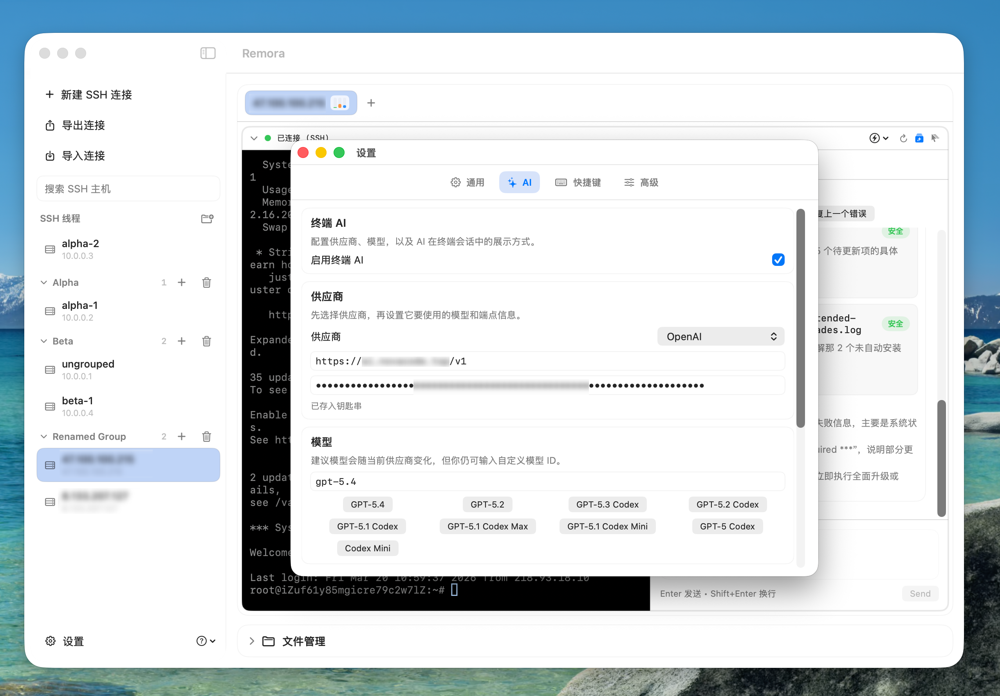

<p align="center">
  
</p>

<h1 align="center">Remora</h1>

<p align="center"><strong>轻量、纯原生、AI 加持的 macOS Shell 工作台。</strong></p>

<p align="center">
  一个使用 SwiftUI 构建的原生 macOS SSH + SFTP + AI 工作台，聚焦轻量、纯原生和高频终端体验。
</p>

> [!WARNING]
> Remora 目前仍是 WIP 的早期版本，功能和交互还会持续调整，也可能存在缺口或回归问题。若你遇到 Bug、回归或任何不顺手的体验，请尽快提交 Issue：<https://github.com/wuuJiawei/Remora/issues>

<p align="center">
  <a href="./README_EN.md">English</a> •
  <a href="./CHANGELOG.md">更新日志</a> •
  <a href="#功能特性">功能特性</a> •
  <a href="#截图">截图</a> •
  <a href="#快速开始">快速开始</a> •
  <a href="#常见问题qa">常见问题</a> •
  <a href="#项目结构">项目结构</a> •
  <a href="#架构">架构</a> •
  <a href="#测试">测试</a> •
  <a href="#社区">社区</a> •
  <a href="#参与贡献">参与贡献</a>
</p>

---

## 为什么是 Remora？

Remora 聚焦在一个实用组合：

- 原生 macOS 体验的连接与会话管理。
- SSH 与 SFTP 在一个工作区内协同完成。
- AI 助手自然嵌入终端流程，用来解释输出、建议命令、辅助排障，而不是强行把终端变成聊天应用。
- 轻量、纯原生、尽量低心智负担：打开就能连，设置清晰，日常工作不需要围着复杂代理系统转。

## 功能特性

- Fantastic：本地优先的 SSH + SFTP 工作区，支持现代 TUI 所需 ANSI/VT、xterm 风格选择、快捷命令/快捷路径、拖拽传输。
- Beautiful：原生 macOS 视觉与交互，布局简洁，支持浅色/深色/跟随系统，终端专注无干扰。
- AI-assisted：内置 Terminal AI，支持 provider → model 配置、自定义 endpoint、OpenAI / Claude 兼容接口、上下文压缩、排队提问、命令建议与解释。
- Fast：Swift 6 原生实现 + SwiftTerm 终端栈 + 原生 macOS UI，面向高频 TUI 与滚动场景优化。
- Secure：采用本地优先的凭据策略，配置与已保存密码写入 `~/.config/remora` 本地 JSON 文件，SSH 主机指纹通过 `StrictHostKeyChecking=ask` 显式确认，任何明文密码导出或复制都需要用户主动确认。
- Simple：轻量设计，99% Swift-native 技术栈，默认配置即可开箱使用，并支持键盘快捷工作流。

### 你现在就可以做的事

- 在同一工作区里运行本地 Shell 与 SSH 会话（多标签/分栏）。
- 管理主机分组、搜索、收藏，并使用快速连接。
- 通过 SFTP 文件管理器执行新建、重命名、移动、删除、复制/粘贴、上传/下载。
- 拖拽上传到目录或当前路径，带目标高亮与提示。
- 获取即时操作反馈（toast）并重试失败传输。
- 需要时开启终端目录与文件管理目录同步。
- 在终端侧边面板里使用 Terminal AI 解释输出、建议下一条命令、修复常见错误，并在长对话中自动压缩上下文。
- 在设置中配置语言、外观、快捷键和指标采样。

## 截图

<table>
  <tr>
    <td width="50%" valign="top">
      <strong>SSH 工作区</strong><br />
      
    </td>
    <td width="50%" valign="top">
      <strong>终端（TUI 友好）</strong><br />
      
    </td>
  </tr>
  <tr>
    <td width="50%" valign="top">
      <strong>文件管理 + 传输流程</strong><br />
      
    </td>
    <td width="50%" valign="top">
      <strong>Terminal AI 对话</strong><br />
      
    </td>
  </tr>
  <tr>
    <td width="50%" valign="top">
      <strong>Terminal AI 设置</strong><br />
      
    </td>
    <td width="50%" valign="top">
      &nbsp;
    </td>
  </tr>
</table>

## 快速开始

### 环境要求

- macOS 14+
- Xcode 15.4+

### 开发运行

```bash
swift build
swift run RemoraApp
```

如果你更习惯 Xcode，直接打开 `Remora.xcodeproj`，首次等待 Xcode 自动解析 Swift packages，然后运行 `Remora` scheme 即可。

### 本地打包

正式的本地打包与 GitHub Actions 使用同一条命令：

```bash
./scripts/package_macos.sh --arch "$(uname -m)" --version 0.0.0-local --build-number 1
```

输出文件位于 `dist/`，例如：

```bash
dist/Remora-0.0.0-local-macos-arm64.zip
```

可选压力工具：

```bash
swift run terminal-stress
```

## 测试

运行核心测试：

```bash
swift test
```

运行 UI 自动化测试（按需开启）：

```bash
REMORA_RUN_UI_TESTS=1 swift test --filter RemoraUIAutomationTests
```

如果 `RemoraApp` 二进制路径非默认：

```bash
REMORA_RUN_UI_TESTS=1 REMORA_APP_BINARY=/abs/path/to/RemoraApp swift test --filter RemoraUIAutomationTests
```

## 常见问题（QA）

### Q: 打开下载的 `Remora.app` 时提示“已损坏，无法打开”怎么办？

A: 先确认这是你信任的来源（例如 GitHub Releases），并且你解压的是完整的 `Remora.app`。  
然后在终端执行（把路径替换成你本地实际路径）：

```bash
xattr -dr com.apple.quarantine /path/to/Remora.app
```

### Q: 去除隔离标记后还是无法打开，怎么办？

A: 到系统设置手动放行一次：

1. 打开“系统设置” -> “隐私与安全性”。
2. 在安全提示区域找到被阻止的 `Remora.app`。
3. 点击“仍要打开”并确认。

## 项目结构

- `Sources/RemoraCore`：SSH/SFTP/会话/主机/安全/核心模型。
- `Sources/RemoraTerminal`：SwiftTerm 适配层与 app 侧终端视图集成。
- `Sources/RemoraApp`：SwiftUI 应用、工作区 UI、设置、文件管理。
- `Sources/TerminalStressTool`：终端吞吐/压力工具。
- `Tests/*`：core、terminal、app 测试。
- `docs/`：清单、截图与运行说明文档。

## 参与贡献

欢迎贡献代码与建议。

- 提交 PR 前请先阅读 [`CONTRIBUTING.md`](./CONTRIBUTING.md)。
- 社区互动请遵守 [`CODE_OF_CONDUCT.md`](./CODE_OF_CONDUCT.md)。
- Bug 或功能建议请使用 [GitHub Issues](https://github.com/wuuJiawei/Remora/issues)。

## 社区

- GitHub: [wuuJiawei/Remora](https://github.com/wuuJiawei/Remora)
- Issues: [提交 Bug / 功能建议](https://github.com/wuuJiawei/Remora/issues)
- Support: [`SUPPORT.md`](./SUPPORT.md)
- X（更新公告）: [@1Javeys](https://x.com/1Javeys)

## 致谢

Remora 在设计与实现过程中受到了以下项目和产品的启发或帮助：

- [opencode](https://github.com/anomalyco/opencode)
- [oh-my-opencode](https://github.com/code-yeongyu/oh-my-openagent)
- [SwiftTerm](https://github.com/migueldeicaza/SwiftTerm)
- [OpenAI](https://github.com/openai)
- [Claude Code](https://github.com/anthropics/claude-code)

特别感谢 [2Libra](https://2libra.com/) 和 [V2EX](https://www.v2ex.com/) 社区。

两个社区的早期用户提供了不少非常有价值的反馈，也帮助发现了不少问题，对于产品的进步和成熟提供了极大的帮助。

感谢每一位愿意试用、讨论、提出建议和指出问题的朋友。

## 安全

请阅读 [`SECURITY.md`](./SECURITY.md) 了解负责任披露流程。

## 许可证

本项目采用 MIT License，详见 [`LICENSE`](./LICENSE)。
