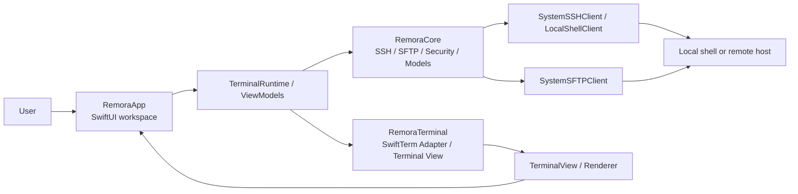

# Remora Architecture

This document gives a high-level view of how the three main modules fit together.

## Module Roles

- `RemoraCore`: SSH, SFTP, host models, credential handling, host key trust, and shared
  session abstractions.
- `RemoraTerminal`: SwiftTerm adapter layer plus app-facing terminal view integration.
- `RemoraApp`: SwiftUI application shell, workspace UI, settings, file manager, transfer
  flows, and runtime orchestration.

## High-Level Diagram

## Typical Data Flow

1. `RemoraApp` collects user intent from the SwiftUI workspace, settings, or file manager.
2. View models and `TerminalRuntime` translate that intent into session and transfer
   actions.
3. `RemoraCore` talks to the local shell, SSH, SFTP, file-backed config/credential storage, and host key trust helpers.
4. `RemoraTerminal` bridges PTY/SSH data into SwiftTerm and exposes the terminal view back to the app UI.

## Boundary Rules

- `RemoraApp` owns user-facing workflow and presentation state.
- `RemoraTerminal` stays focused on terminal integration concerns and isolates SwiftTerm from the app layer.
- `RemoraCore` owns transport, persistence, security, and reusable domain logic.
- App-level features should prefer depending on `RemoraCore` and `RemoraTerminal` rather
  than re-implementing protocol or parser behavior in the UI layer.
